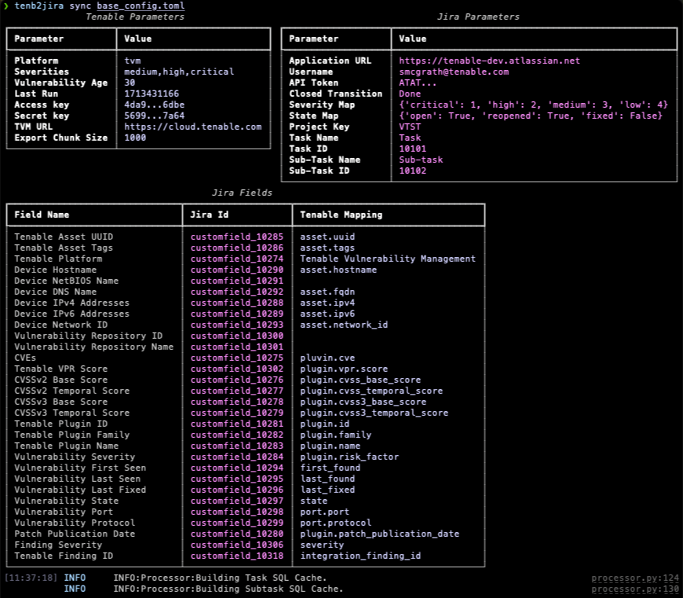
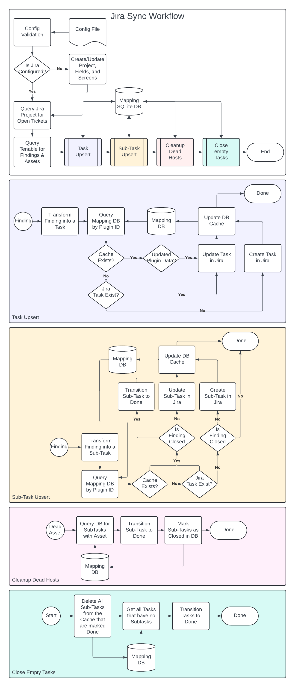

# Tenable to Jira Cloud Sync Tool

This integration is designed to pull Tenable.io vulnerability data, then
generate Jira Tasks and sub-tasks based on the vulnerabilities' current state.
Vulnerabilities are automatically closed once the state of the vulnerability
is marked as "fixed" in Tenable.io or Tenable.sc.

* The integration creates a _**Vulnerability Management**_ _Business_ project
  using the project key _**VULN**_ and the _Simplified Task Tracking_ template.
  The integration then creates the appropriate custom fields and links them to
  the associated screen that stores and displays all of the necessary
  information.
* The integration creates a _**Task**_ for each Vulnerability and creates each
  _vulnerability instance_ as a _**Sub-task**_.  Example: if you have 5 hosts
  with [plugin 151074][151074], the integration creates 1 Task with the details
  of [151074] and creates 5 Sub-tasks, each one pointing to a specific instance
  of the vulnerability on a specific host.
* Vulnerability Instances (Sub-tasks) are closed automatically by the
  integration once the vulnerability is _**fixed**_ in Tenable.io.
* Vulnerabilities (Tasks) are closed once all Sub-tasks enter a closed state.
* If a vulnerability is re-opened, new issue tickets are generated
  (The integration will not reopen previously closed issues (otherwise known
  as necromancy))
* All data imports from Tenable.io use the last_found/last_seen fields.  This
  ensures that all issues are updated whenever new information becomes
  available, unless overridden with the `--first-discovery` flag.
* For those that don't mind a bit more management of the script in exchange for
  less permissions, there is a **setup-only** mode that will create the project,
  fields, and screens, then generate a full configuration file afterwards.  This
  file must be then used for all future runs of the integration and may need to
  be modified with the new, non-elevated user's authentication settings.
* Task summaries are generated using the following formula:

```
[Plugin ID] Plugin Name
```

* Sub-task summaries are generated using the following formula:

```
[IP Address/Port Number/Protocol] [Plugin ID] Plugin Name
```

The integration will create the following fields into the Jira instance

| Field Name                    | Field Type    | v1 Field Type | Screen Tab    |
|:------------------------------|:-------------:|:-------------:|:-------------:|
| Tenable Asset UUID            | labels        | labels        | Asset         |
| Tenable Asset Tags            | labels        | labels        | Asset         |
| Tenable Platform              | readonlyfield | readonlyfield | Asset         |
| Device Hostname               | readonlyfield | readonlyfield | Asset         |
| Device NetBIOS Name           | readonlyfield | readonlyfield | Asset         |
| Device DNS Name               | readonlyfield | readonlyfield | Asset         |
| Device IPv4 Addresses         | labels        | labels        | Asset         |
| Device IPv6 Addresses         | labels        | labels        | Asset         |
| Device Network ID             | readonlyfield | readonlyfield | Asset         |
| Vulnerability Repository ID   | readonlyfield | readonlyfield | Asset         |
| Vulnerability Repository Name | readonlyfield | readonlyfield | Asset         |
| CVEs                          | labels        | labels        | Vulnerability |
| Tenable VPR Score             | float         | readonlyfield | Vulnerability |
| CVSSv2 Base Score             | float         | readonlyfield | Vulnerability |
| CVSSv2 Temporal Score         | float         | readonlyfield | Vulnerability |
| CVSSv3 Base Score             | float         | readonlyfield | Vulnerability |
| CVSSv3 Temporal Score         | float         | readonlyfield | Vulnerability |
| Tenable Plugin ID             | readonlyfield | readonlyfield | Vulnerability |
| Tenable Plugin Family         | readonlyfield | readonlyfield | Vulnerability |
| Tenable Plugin Name           | readonlyfield | readonlyfield | Vulnerability |
| Vulnerability Severity        | readonlyfield | readonlyfield | Vulnerability |
| Vulnerability First Seen      | datetime      | datetime      | Vulnerability |
| Vulnerability Last Seen       | datetime      | datetime      | Vulnerability |
| Vulnerability Last Seen       | datetime      | datetime      | Vulnerability |
| Vulnerability Last Fixed      | datetime      | datetime      | Vulnerability |
| Vulnerability State           | readonlyfield | readonlyfield | Vulnerability |
| Vulnerability Port            | readonlyfield | readonlyfield | Vulnerability |
| Vulnerability Protocol        | readonlyfield | readonlyfield | Vulnerability |
| Patch Publication Date        | date          | date          | Vulnerability |
| Finding Severity              | readonlyfield |               | Vulnerability |
| Tenable Finding ID            | readonlyfield |               | Vulnerability |

* Vulnerability Definition (Task Issue-Type) uniqueness is determined by the
  following attributes:
  * Tenable Plugin ID

* Vulnerability Instance (Sub-Task Issue-Type) uniqueness is determines by the
  following attributes:
 * Tenable Platform
 * Tenable Plugin ID
 * Tenable Asset UUID
 * Device IPv4 Addresses
 * Device IPv6 Addresses
 * Vulnerability Port
 * Vulnerability Protocol

[151074]: https://www.tenable.com/plugins/nessus/131074

## Requirements

* Python 3.10+ Installed (Versions less than 3.10 are untested and YMMV).
* Tenable.io API Keys associated to an account with "CanView" permissions
  for "AllAssets" (required for the Vuln Export APIs)
* Tenable.sc API Keys associated to an account with full access to the
  vulnerability data.
* For Tenable.sc, an Analysis Query ID that represents the query to run against
  the vulnerability data.
* Jira Cloud Basic Auth API Token and Username.  For automatic project creation
  and management, the account must have Admin privileges.
* A host to run the script on.  This can be located anywhere as the integration
  is cloud-to-cloud.

## Permissions

* The script requires **Site Admin** Access at least initially to create the
  project, the custom fields, and link everything to the right screens.
* The script requires Admin access to the project that it has created.
  Depending on the permissions setup within your own Jira Cloud instance, this
  may not be enough however.  If you are seeing errors, please refer to the
  list of required permissions (below).
* If using setup-only (as Admin) to let the script create all of the
  requirements, afterwards, it's been [reported][i28_perms] that the following
  permissions should yield successful runs:
  * Assignable User
  * Assign Issues
  * Close Issues
  * Create Issues
  * Delete Issues
  * Edit Issues
  * Link Issues
  * Modify Reporter
  * Move Issues
  * Resolve Issues
  * Schedule Issues
  * Set Issue Security
  * Transition Issues

[i28_perms]: https://github.com/tenable/integration-jira-cloud/issues/28#issuecomment-607386580

## Quickstart

### Installation

```
pip install tenb2jira
```

### Configuration

In order to configure the integration, pull either the
[New Integration][nconfig] or the [Version 1 Migration][cconfig] configuration
templates and add populate the configuration file with the relevant details.
The configuration file has documentation within it that should walk you all of
the available settings, however at a minimum, you will need to configure the
following attributes within the following sections:

```toml
[tenable]
platform   = The platform we will be interfacing to.  Either "tvm" or "tsc"
access_key = The API Access key for the account
secret_key = The API Secret key for the account
url        = The URL (if not a TVM instance)

[jira]
api_username = The username that we will be interfacing with
api_token    = The API token we will be using for auth
url          = The URL for the Jira instance.
```

The rest of the settings in the configuration file are pre-configured for the
most common use cases, however can be modified if need be.  For information
on what the various settings do, refer to the documentation within the config
file itself for more information.

Once the configuration file has been modified and saved, you can confirm that
the changes are still valid using the "validate" command within the CLI.

```
tenb2jira validate /path/to/config.toml
```

[nconfig]: tmpl_v2_new_config.toml
[cconfig]: tmpl_v1_conversion_config.toml

### Initial Setup

We a valid configuration file, we can tell the integration to create and/or
link up the project, issue-types, and fields necessary to make this integration
run.  To perform this operation, simply run the following:

```
tenb2jira build /path/to/config.toml
```

Once the Jira project setup process is complete, a series ot tables will be
returned to the screen detailing what was setup, which should look similar
to this:



If everything looks good, then we can move on to the actual sync!

### General operation

This integration is designed to first query Jira and get the listing of open
issues, store them in a sqlite database, and then query the Tenable platform to
get the findings.  From there we will match up against that mapping database
any existing findings, search Jira for anything that could match if that fails,
and lastly create a new issue if no matches exist in either the database or
within Jira.  For a more detailed workflow diagram, scroll to the bottom of
this document.

Once the job has completed, a `last_run` parameter will also be added/updated
to the `[tenable]` section of the configuration file.  This parameter will be
used for subsequent runs to pull the updates from that timestamp.

To launch the integration, just run the sync command:

```
tenb2jira sync /path/to/config.toml
```



